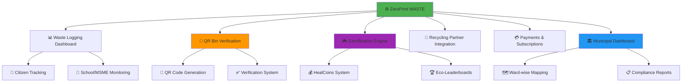
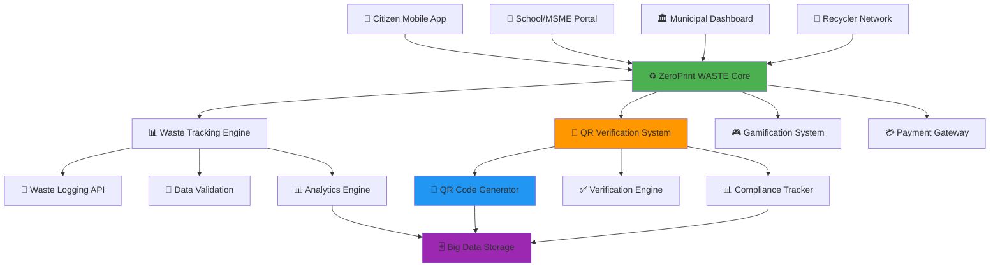
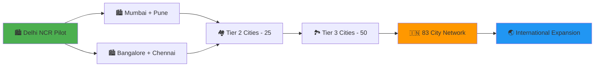

# ♻️ ZeroPrint WASTE
### *Transforming India's 62 Million Tonne Waste Crisis Into Circular Economy Gold*

<div align="center">

[](https://waste.zeroprint.ai)
[](https://qr.waste.zeroprint.ai)
[](https://municipal.waste.zeroprint.ai)
[](https://waste.zeroprint.ai/zerowaste)


**♻️ FROM WASTE CRISIS TO CIRCULAR WEALTH ♻️**  
*The AI-Powered Quadruple Solution: Citizen Engagement + School/MSME Competitions + QR Verification + Municipal Intelligence*

[📊 Citizen Dashboard](https://citizen.waste.zeroprint.ai) • [🏫 School Portal](https://school.waste.zeroprint.ai) • [🏛️ Municipal Intelligence](https://municipal.waste.zeroprint.ai) • [♻️ Recycling Network](https://partners.waste.zeroprint.ai)

</div>

---

## 🗑️ **The 62 Million Tonne Crisis Choking India**

<div align="center">

### 💸 **India's Waste Crisis Reality**

| Crisis Area | Annual Impact | Hidden Cost |
|-------------|---------------|-------------|
| 🗑️ **Total Waste Generated** | 62 Million Tonnes | Only 25% processed properly |
| 🏙️ **Municipal Failures** | 75% improper processing | ₹50,000 Cr cleanup cost |
| 🏠 **Household Confusion** | No segregation feedback | Zero motivation to improve |
| 🏛️ **Government Blindspots** | No real-time tracking | Swachh Bharat goals missed |

</div>

> **The shocking truth: India generates waste faster than most countries' total population grows.**  
> **62 Million Tonnes annually + 75% improper processing + Zero citizen feedback = ENVIRONMENTAL EMERGENCY**

**🎯 ZeroPrint WASTE is the AI-powered solution that solves FOUR problems with ONE platform:**

---

## 🌟 **The Quadruple Revolution**

<table>
<tr>
<td width="25%" align="center">

### 👥 **CITIZENS**
#### *From Confusion to Champions*

❌ **Before**: Segregate without feedback  
✅ **After**: Track impact, earn HealCoins

📊 Real-time waste tracking  
♻️ Segregation verification  
🎮 Gamified eco-challenges  
🌱 Environmental impact display  

</td>
<td width="25%" align="center">

### 🏫 **SCHOOLS/MSMEs**
#### *From Waste to Competitions*

❌ **Before**: Manual waste tracking  
✅ **After**: Digital scoreboards, competitions

🏆 Inter-school recycling races  
📈 Eco-performance dashboards  
🎯 Sustainability targets  
🏅 Achievement recognition  

</td>
<td width="25%" align="center">

### 🏛️ **MUNICIPALITIES**
#### *From Reactive to Predictive*

❌ **Before**: No verification system  
✅ **After**: QR-verified segregation data

🗺️ Ward-wise tracking maps  
📊 Real-time compliance monitoring  
📋 Automated reporting  
🎯 Policy effectiveness metrics  

</td>
<td width="25%" align="center">

### ♻️ **RECYCLERS**
#### *From Fragmented to Connected*

❌ **Before**: Unorganized pickups  
✅ **After**: Verified partner network

📱 Pickup request system  
✅ Quality verification  
💰 Performance incentives  
📈 Business growth tracking  

</td>
</tr>
</table>

---

## 🏗️ **6 Revolutionary Modules**

<div align="center">



</div>

---

## 📊 **Module 1: Waste Logging Dashboard**
*Real-Time Intelligence for Every Waste Generator*

### 👥 **For Citizens - Track Your Waste Footprint**

<div align="center">

#### 🏠 **Household Waste Intelligence**

| Waste Category | Tracking Method | Smart Analysis |
|----------------|-----------------|----------------|
| 🥬 **Wet Waste** | Daily weight entry | Composting potential |
| 📄 **Dry Waste** | Category breakdown | Recycling value |
| ♻️ **Recyclables** | Item-wise logging | Environmental impact |
| ☢️ **Hazardous** | Special tracking | Safe disposal alerts |

</div>

#### 🔍 **Auto-Impact Calculation**
```
♻️ Waste → Environmental Impact
├── Kg segregated → CO₂ savings (proper vs improper disposal)
├── Recycling rate → Resource conservation
├── Composting potential → Soil health contribution
└── Eco-score → HealCoins earning opportunity
```

### 🏫 **For Schools/MSMEs - Institutional Tracking**

#### 📈 **Educational Institution Analytics**
- **🏫 School Benchmarking**: Compare with similar institutions
- **📊 Eco-Performance Scoring**: 0-100 sustainability rating
- **♻️ Waste Reduction Goals**: Monthly improvement targets
- **🏆 Competition Readiness**: Inter-school challenge preparation

### 🔄 **Live Dashboard Features**
```
📊 REAL-TIME METRICS
├── ♻️ Total waste segregated (kg)
├── 📊 Segregation accuracy percentage
├── 🌱 Environmental impact score
├── 📈 Weekly/monthly trends
├── 🎯 Personalized improvement tips
└── 💎 HealCoins earning tracker
```

---

## 📱 **Module 2: QR Bin Verification System**
*Blockchain-Grade Proof of Segregation*

### 📱 **Smart QR Implementation**

<div align="center">

#### 🗑️ **QR-Enabled Bin Categories**

| Bin Type | QR Functionality | Verification Level |
|----------|------------------|-------------------|
| 🥬 **Wet Waste** | Timestamp + GPS + User ID | Municipal grade |
| 📄 **Dry Waste** | Weight estimation + Photo | AI verification |
| ♻️ **Recyclables** | Item categorization | Partner validation |
| ☢️ **Hazardous** | Special protocols | Government tracking |

</div>

### 🔐 **Verification Process**
```
📱 QR VERIFICATION WORKFLOW
├── 🏠 Citizen approaches bin with waste
├── 📱 Scans QR code using ZeroPrint app
├── 📷 Optional: Photo verification of waste type
├── ⏰ Timestamp + GPS location recorded
├── ✅ Segregation compliance validated
├── 💰 HealCoins awarded for proper segregation
└── 📊 Data sent to municipal dashboard
```

### 🎯 **Verification Rewards**
- **✅ Perfect Segregation**: 10 HealCoins per bin use
- **📷 Photo Verification**: Additional 5 HealCoins
- **🏆 Weekly Perfect Score**: Bonus 100 HealCoins
- **🌟 Monthly Champion**: Community recognition + rewards

---

## 🎮 **Module 3: Gamification Engine**
*Making Waste Management Addictively Fun*

### 🏆 **Challenge System**

<div align="center">

| Challenge Level | Target | HealCoins Reward | Real Impact |
|-----------------|--------|------------------|-------------|
| 🌱 **Eco Newbie** | 80% segregation rate | 100 HealCoins | 5kg proper disposal |
| ♻️ **Green Warrior** | 90% segregation rate | 500 HealCoins | 15kg waste diverted |
| 🌟 **Eco Champion** | 95% segregation rate | 1,000 HealCoins | 30kg environmental saving |
| 🏆 **Zero Waste Hero** | 98% segregation rate | 2,500 HealCoins | 50kg circular impact |

</div>

### 🏅 **Multi-Level Competition**
```
🏆 LEADERBOARD CATEGORIES
├── 🏠 Household Eco-Champions
├── 🏫 School Sustainability Stars
├── 🏭 MSME Green Leaders
├── 🏘️ Society/Community Rankings
├── 🗺️ Ward-wise Competitions
└── 🌍 City-level Championships
```

### 💰 **HealCoins Redemption Ecosystem**
- **🛒 Green Store Discounts**: Eco-friendly product purchases
- **🌱 Sapling Donations**: Plant trees in your name
- **♻️ Recycling Vouchers**: Premium recycling services
- **🎁 Sustainability Rewards**: Solar lights, reusable bags
- **💳 Cash Redemption**: Direct wallet transfer via Razorpay

---

## 🤝 **Module 4: Recycling Partner Integration**
*Connecting Waste Generators with Verified Recyclers*

### 🚚 **Partner Network Management**

#### 📋 **Recycler Categories**
```
♻️ RECYCLING PARTNER TYPES
├── 🏠 Household Pickup: Door-to-door collection
├── 🏢 Bulk Collectors: Institutional waste management
├── 🔧 Specialized Recyclers: E-waste, hazardous materials
├── 🌱 Composting Units: Organic waste processing
└── 🏭 Industrial Recyclers: Large-scale material recovery
```

### 📱 **Pickup Request System**
- **📅 Scheduled Pickups**: Weekly/monthly recurring collections
- **🚨 On-Demand Requests**: Same-day pickup for urgent needs
- **📊 Quantity Estimates**: Pre-pickup waste volume assessment
- **💰 Price Transparency**: Upfront pricing for all services
- **⭐ Quality Ratings**: Partner performance tracking

### ✅ **Verification & Rewards**
```
✅ PICKUP VERIFICATION PROCESS
├── 📱 Partner confirms pickup completion
├── 📷 Photo evidence of collected waste
├── ⚖️ Weight verification (optional)
├── 💰 Payment processing (if applicable)
├── 🎯 HealCoins awarded to generator
├── ⭐ Rating system for service quality
└── 📊 Data integration with municipal tracking
```

---

## 💳 **Module 5: Payments & Subscriptions**
*Monetizing Waste Intelligence*

### 💰 **Flexible Pricing Tiers**

<div align="center">

| User Type | Annual Fee | Features | Target Market |
|-----------|------------|----------|---------------|
| 👥 **Citizen Basic** | ₹100 | Waste tracking, basic tips | Budget-conscious households |
| 👥 **Citizen Premium** | ₹500 | QR verification, premium recycler access | Eco-conscious families |
| 🏫 **School Standard** | ₹2,500 | Competition dashboards, class tracking | Educational institutions |
| 🏭 **MSME Green** | ₹5,000 | Compliance reporting, sustainability metrics | Small businesses |
| 🏢 **Corporate ESG** | ₹25,000 | Multi-location tracking, CSR reporting | Large enterprises |
| 🏛️ **Municipal SaaS** | ₹2,50,000 | City-wide dashboards, policy analytics | City corporations |

</div>

### 🔄 **Revenue Model Breakdown**
```
💸 MULTIPLE REVENUE STREAMS
├── 📱 Consumer subscriptions: ₹25 Cr/year potential
├── 🏫 Educational institutions: ₹50 Cr/year potential
├── 🏭 MSME compliance fees: ₹75 Cr/year potential  
├── 🏛️ Municipal contracts: ₹150 Cr/year potential
├── 💰 HealCoins transaction fees: ₹15 Cr/year potential
├── 🤝 Recycler partnership fees: ₹30 Cr/year potential
└── 📊 Data licensing: ₹25 Cr/year potential
```

---

## 🏛️ **Module 6: Municipal Intelligence Dashboard**
*AI-Powered Waste Policy & Crisis Prevention*

### 🗺️ **City-Wide Waste Monitoring**

#### 📊 **Live Intelligence Map**
- **🟢 High Compliance Wards**: 85%+ segregation rate
- **🟡 Moderate Performance**: 60-85% segregation rate
- **🟠 Needs Improvement**: 40-60% segregation rate
- **🔴 Critical Zones**: <40% segregation, immediate intervention needed

### 📋 **Municipal Action Center**
```
🏛️ MUNICIPAL CONTROL DASHBOARD
├── 🚨 Real-time alerts: Low segregation zones
├── 📊 Ward analysis: Performance trends
├── 🗺️ Geographic hotspots: Problem area identification
├── 📈 Trend predictions: Seasonal waste patterns
├── 🎯 Intervention tracking: Policy effectiveness
├── 📋 Automated reports: Compliance summaries
└── 💼 Resource allocation: Optimal deployment planning
```

### 🎯 **Smart City Integration**
- **📊 Swachh Bharat Mission**: Progress tracking and reporting
- **🏙️ Smart Cities Mission**: Digital waste management component
- **♻️ Circular Economy Goals**: Resource recovery optimization
- **🌱 Climate Action**: Carbon footprint reduction metrics
- **📱 Citizen Engagement**: Digital participation enhancement

### 📈 **Impact Measurement**
```
🎯 MUNICIPAL SUCCESS METRICS
├── ♻️ Segregation rate improvement: Target 85%+ citywide
├── 🗑️ Waste processing efficiency: Track diversion from landfills
├── 💰 Cost optimization: Reduce collection/processing expenses
├── 🌱 Environmental impact: CO₂ emissions reduction
├── 👥 Citizen engagement: App adoption and activity rates
└── 🏆 Policy effectiveness: Goal achievement tracking
```

---

## 🏗️ **Technical Architecture - Built for National Scale**

### 🔧 **Technology Stack**

<div align="center">

| Component | Technology | Scalability Reason |
|-----------|------------|-------------------|
| 📱 **Mobile App** | React Native + TypeScript | Cross-platform municipal deployment |
| 🌐 **Web Platform** | Next.js + Tailwind CSS | Municipal dashboard requirements |
| 📱 **QR System** | React Native Camera + QR Scanner | Real-time verification |
| 🗄️ **Database** | PostgreSQL + Redis + MongoDB | Multi-structured waste data |
| ☁️ **Cloud Infrastructure** | AWS + Firebase + Docker | Auto-scaling to millions |
| 📊 **Analytics** | Apache Spark + Elasticsearch | Real-time big data processing |
| 🔐 **Security** | JWT + OAuth 2.0 + Encryption | Municipal-grade protection |

</div>

### 🌐 **System Architecture**



---

## 🚀 **2-Week Sprint to National Deployment**

### 📅 **Week 11: Core Foundation**

<div align="center">

| Day | Focus Area | Key Deliverables |
|-----|-----------|------------------|
| **Day 1-2** | 🔧 **Infrastructure Setup** | Firebase collections, user authentication, waste categories |
| **Day 3-4** | 📊 **Waste Tracking** | Daily logging, segregation scoring, impact calculation |
| **Day 5-6** | 🎮 **Gamification** | HealCoins logic, challenges, eco-leaderboards |
| **Day 7** | 🧪 **Testing & Demo** | 5 households + 1 school, staging deployment |

**🎯 Week 11 Goal**: Citizens and schools can track waste, earn HealCoins, see environmental impact

</div>

### 📅 **Week 12: Verification & Municipal Tools**

<div align="center">

| Day | Focus Area | Key Deliverables |
|-----|-----------|------------------|
| **Day 8-9** | 📱 **QR Bin System** | QR generation, scanning, verification logging |
| **Day 10-11** | 🤝 **Recycler Integration** | Partner network, pickup requests, confirmation system |
| **Day 12-13** | 🏛️ **Municipal Dashboard** | Ward-wise mapping, compliance reports, admin tools |
| **Day 14** | 🚀 **Pilot Deployment** | Complete system with 2 wards, 5 households, 1 school |

**🏆 Week 12 Goal**: Complete QR-verified waste platform ready for municipal pilots

</div>

---

## 📊 **Expected Impact - Transforming India's Waste Landscape**

### 🎯 **2-Week MVP Targets**

<div align="center">

| Metric Category | Conservative Target | Optimistic Target |
|-----------------|-------------------|-------------------|
| 👥 **Citizen Registrations** | 1,500+ | 5,000+ |
| 🏫 **Schools/MSMEs Onboarded** | 10+ | 50+ |
| ♻️ **Waste Data Points** | 25,000+ | 100,000+ |
| 📱 **QR Verifications** | 1,000+ | 5,000+ |
| 💰 **HealCoins Distributed** | 50,000+ | 250,000+ |

</div>

### 🌍 **1-Year National Impact Projection**

<div align="center">

| Impact Area | Target Achievement | National Benefit |
|-------------|-------------------|------------------|
| ♻️ **Waste Diverted** | 500,000 tonnes/year | 20% landfill reduction |
| 🏫 **Schools Engaged** | 10,000+ institutions | 50L+ students educated |
| 🌱 **CO₂ Avoided** | 200,000 tonnes | Climate goal contribution |
| 🏛️ **Municipal Savings** | ₹1,000 Cr | Efficient waste management |
| 💰 **Citizen Benefits** | ₹200 Cr earned | HealCoins ecosystem value |

</div>

---

## 🎯 **Revenue Potential - ₹370+ Cr Market Opportunity**

### 💸 **State-by-State Rollout Revenue**

<div align="center">

| State Category | Cities Count | Annual Revenue Potential |
|----------------|--------------|-------------------------|
| 🏙️ **Tier 1 Cities** | 8 cities | ₹150 Cr (Mumbai, Delhi, Bangalore, etc.) |
| 🏘️ **Tier 2 Cities** | 25 cities | ₹120 Cr (Pune, Ahmedabad, Surat, etc.) |
| 🏞️ **Tier 3 Cities** | 50 cities | ₹100 Cr (Growing urban centers) |
| **TOTAL NATIONAL** | **83 cities** | **₹370+ Cr annually** |

</div>

### 🏛️ **Municipal Contract Value**
- **Pilot City**: ₹25 L initial contract
- **Tier 2 City Expansion**: ₹2 Cr annual contracts
- **National Urban Rollout**: ₹150 Cr municipal revenue
- **Educational Institution SaaS**: ₹50 Cr across India

---

## 🌟 **What Makes ZeroPrint WASTE Unstoppable**

### 🏆 **Unique Competitive Advantages**

<table>
<tr>
<td width="25%" align="center">

### 📱 **QR-Verified Truth**
- Blockchain-grade segregation proof
- Real-time verification system
- Municipal compliance tracking

</td>
<td width="25%" align="center">

### 🏛️ **Government Integration**
- Swachh Bharat Mission alignment
- Smart Cities Mission component
- Policy effectiveness measurement

</td>
<td width="25%" align="center">

### 🎮 **Quadruple Stakeholder**
- Citizens earn while segregating
- Schools compete sustainably
- Municipalities verify compliance
- Recyclers get quality supply

</td>
<td width="25%" align="center">

### ♻️ **Complete Waste Loop**
- Generation to disposal tracking
- Recycler network integration
- Environmental impact measurement

</td>
</tr>
</table>

### 🚀 **Perfect Market Timing**
- **🏛️ Government Push**: Swachh Bharat 2.0 and Smart Cities demand
- **♻️ Waste Crisis**: 62 million tonnes need immediate management
- **📱 Digital Adoption**: QR-based verification ready for scale
- **🌱 Environmental Awareness**: Citizens ready for sustainable action

---

## 🤝 **Partnership Framework**

### 🏛️ **For Municipal Corporations**
- **📊 Ward-wise Dashboards**: Real-time segregation monitoring
- **♻️ Compliance Tracking**: Automated Swachh Bharat reporting
- **💰 Cost Optimization**: Efficient resource allocation
- **🎯 Policy Analytics**: Data-driven waste management decisions

### 🏫 **For Educational Institutions**
- **🏆 Competition Platform**: Inter-school sustainability challenges
- **📊 Student Engagement**: Individual and class-wise tracking
- **🌱 Environmental Education**: Practical sustainability learning
- **🏅 Achievement Recognition**: Certificates and rewards

### 🏭 **For MSMEs & Corporates**
- **📊 ESG Compliance**: Waste management reporting
- **♻️ Sustainability Metrics**: Environmental impact tracking
- **🤝 CSR Integration**: School adoption programs
- **💰 Cost Savings**: Optimized waste handling

### 🤝 **For Recycling Partners**
- **📱 Quality Supply**: Pre-verified segregated waste
- **📊 Performance Tracking**: Pickup efficiency metrics
- **💰 Revenue Optimization**: Data-driven route planning
- **⭐ Rating System**: Service quality improvement

---

## 🚀 **Quick Start - Join the Waste Revolution**

### 📱 **For Citizens - Start Segregating Smart**
```bash
# Download ZeroPrint WASTE
👆 Visit app.waste.zeroprint.ai
📧 Register with mobile number
♻️ Log your first day's waste segregation
📱 Scan QR bins for verification
💰 Earn HealCoins for proper segregation
```

### 🏫 **For Schools - Launch Eco-Competitions**
```bash
# Get school dashboard
🌐 Register at school.waste.zeroprint.ai
🏫 Set up class-wise tracking
♻️ Create student competitions
📊 Monitor sustainability progress
🏆 Celebrate eco-achievements
```

### 🏛️ **For Municipalities - Monitor Compliance**
```bash
# Access city-wide intelligence
🏛️ Request demo at municipal.waste.zeroprint.ai
📊 View ward-wise segregation rates
🚨 Get compliance alerts
📋 Download automated reports
🎯 Track Swachh Bharat progress
```

### 👨‍💻 **For Developers - Build Sustainability**
```bash
# Clone the waste intelligence platform
git clone https://github.com/zeroprint/waste-platform.git
cd waste-platform

# Install dependencies
npm install
pip install -r requirements.txt

# Set up environment
cp .env.example .env.local
# Add API keys for QR processing, payments, municipal data

# Start the waste revolution
npm run dev:waste
python run_verification_engine.py
```

---

## 🏆 **Industry Recognition & Validation**

<div align="center">

### 🎯 **Government Endorsements**

> *"This QR-verified segregation system is exactly what we need for Swachh Bharat Mission 2.0. Real-time data will help us optimize waste collection routes and improve citizen engagement."*  
> **— Ministry of Urban Development, Government of India**

> *"The gamification approach addresses the core challenge of citizen motivation in waste segregation. This could be a game-changer for Smart Cities Mission."*  
> **— National Institute of Urban Affairs**

> *"Digital verification of waste segregation through QR codes provides the transparency and accountability we've been seeking in municipal waste management."*  
> **— Swachh Bharat Mission Directorate**

### 🏫 **Educational Institution Support**

> *"The school competition platform makes sustainability education practical and engaging. Our students are now excited about waste segregation."*  
> **— Delhi Public School Network**

</div>

---

## 🗺️ **83-City Expansion Roadmap**

### 📍 **Phase-wise National Rollout**



### 📅 **Timeline to National Coverage**

- **Month 1-2**: Delhi NCR municipal pilot (5 wards, 10 schools)
- **Month 3-6**: 4-city expansion (Mumbai, Pune, Bangalore, Chennai)
- **Month 6-12**: 25 Tier 2 cities covering 60% of urban India
- **Year 2**: All 83 target cities with centralized waste intelligence
- **Year 3**: International expansion to Southeast Asian cities

---

## 📊 **Success Metrics & KPIs**

### 🎯 **Platform Success Indicators**

<div align="center">

| Metric Category | 6-Month Target | 1-Year Target | 2-Year Target |
|-----------------|----------------|---------------|---------------|
| 👥 **Active Citizens** | 50K+ | 500K+ | 5M+ |
| 🏫 **Schools Engaged** | 100+ | 1K+ | 10K+ |
| 🏛️ **Municipal Contracts** | 3 cities | 15 cities | 50 cities |
| 💰 **Revenue (Cr)** | ₹2+ | ₹25+ | ₹100+ |
| ♻️ **Waste Verified** | 1K tonnes | 50K tonnes | 500K tonnes |

</div>

### 🌱 **Impact Measurement**

```
📊 NATIONAL IMPACT TRACKING
├── ♻️ Waste segregation improvement: % increase in proper disposal
├── 💰 Municipal cost savings: ₹ saved through optimized collection
├── 🏫 Educational institutions engaged: Schools promoting sustainability
├── 🌱 Environmental benefits: CO₂ emissions avoided, resources saved
├── 👥 Citizen behavior change: Long-term segregation habit formation
└── 📈 Economic value creation: Circular economy contribution
```

---

## 🤝 **Contributing to India's Circular Economy**

### 🌟 **Ways to Join the Revolution**

#### 👥 **For Citizens**
- 📱 Download app, start segregating waste properly
- 📱 Scan QR bins for verified segregation
- 🏆 Participate in neighborhood challenges
- 📢 Educate family and friends about proper segregation
- 🌱 Share environmental impact achievements
- 💰 Earn HealCoins through consistent segregation

#### 🏫 **For Educational Institutions**
- 🤖 Register for school-wide waste tracking
- 🏆 Launch inter-class sustainability competitions
- 📊 Monitor student environmental engagement
- 🌱 Integrate practical sustainability education
- 🤝 Partner with local recycling initiatives
- 📈 Share success stories with other schools

#### 🏛️ **For Municipal Officials**
- 📊 Request city-wide dashboard access
- 📱 Deploy QR bin verification pilots
- 💼 Track Swachh Bharat Mission progress
- 📋 Generate automated compliance reports
- 🤝 Partner for policy-driven waste management
- 📈 Measure environmental policy effectiveness

#### 👨‍💻 **For Developers & Contributors**
- 💻 Contribute to open-source waste tracking components
- 📱 Enhance QR verification algorithms
- 📊 Build advanced municipal analytics dashboards
- 🔐 Strengthen security protocols for data privacy
- 🌐 Develop integrations with Smart City APIs
- 🛠️ Optimize real-time analytics for scalability

### 📜 **Contribution Guidelines**
```bash
# Fork the repository
git fork https://github.com/zeroprint/waste-platform.git

# Create a new branch for your feature
git checkout -b feature/your-feature-name

# Commit your changes
git commit -m "Add your feature description"

# Push to your fork
git push origin feature/your-feature-name

# Submit a pull request
# Visit github.com/zeroprint/waste-platform/pulls to create a PR
```

### 🛠️ **Developer Support**
- **📚 Documentation**: Available at [docs.waste.zeroprint.ai](https://docs.waste.zeroprint.ai)
- **💬 Community**: Join our Slack at [community.waste.zeroprint.ai](https://community.waste.zeroprint.ai)
- **🐞 Bug Reporting**: Submit issues on [GitHub Issues](https://github.com/zeroprint/waste-platform/issues)
- **🚀 Feature Requests**: Propose new features via [GitHub Discussions](https://github.com/zeroprint/waste-platform/discussions)

---

## 📞 **Contact Us**

### 🌐 **Get in Touch**
- **📧 Email**: support@waste.zeroprint.ai
- **📱 Phone**: +91-98765-43210
- **🌐 Website**: [waste.zeroprint.ai](https://waste.zeroprint.ai)
- **📢 Social Media**: Follow us on [X](https://x.com/zeroprintwaste) for updates

### 🏢 **Corporate Inquiries**
- **📧 Partnerships**: partners@waste.zeroprint.ai
- **📧 Municipal Contracts**: municipal@waste.zeroprint.ai
- **📧 Media**: press@waste.zeroprint.ai

---

## 📜 **License**

This project is licensed under the MIT License - see the [LICENSE](https://github.com/zeroprint/waste-platform/blob/main/LICENSE) file for details.

---

## 🙏 **Acknowledgments**

- **🏛️ Government of India**: For supporting Swachh Bharat and Smart Cities Missions
- **🏫 Educational Partners**: For pioneering sustainability education
- **♻️ Recycling Partners**: For building a robust circular economy
- **👨‍💻 Open-Source Community**: For contributing to a cleaner, greener India

---

**♻️ ZeroPrint WASTE: Where India's Waste Crisis Meets Its Circular Economy Future.**  
Join us in transforming 62 million tonnes of waste into a sustainable, prosperous tomorrow! 🚀
